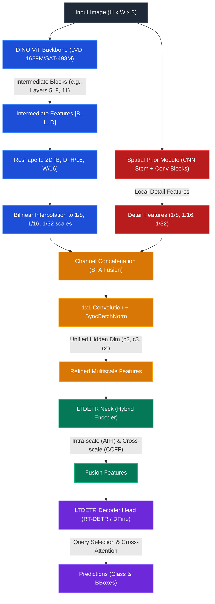

# Geospatial CV & YOLO Training Pipeline (`_trainer_lightly`)

This repository contains a locked, high-performance training, tuning, and evaluation suite for YOLO and RT-DETR model variants (using the Ultralytics and LightlyTrain backends), designed specifically for high-resolution aerial and satellite object detection.

---

## 🚀 Environment & Verification

We use [Pixi](https://pixi.sh/) for dependency and task management. To verify environment code style and static type safety, run:

```bash
# Formats code layout, runs Ruff checks/fixes, and Pyright static type checker
pixi run qa
```

### Available Tasks
* **Linting**: `pixi run lint` (ruff auto-fixes)
* **Formatting**: `pixi run format` (ruff code formatting)
* **Type Safety**: `pixi run check-types` (pyright static check)
* **GPU Diagnostic**: `pixi run check-gpu` (verifies PyTorch CUDA acceleration)
* **Suite Orchestration**:
  * Run Sweeps: `pixi run sweep`
  * Run Training: `pixi run train`
  * Run Baseline Benchmark: `pixi run train-baseline`
  * Run Evaluation: `pixi run eval`
  * Run FiftyOne Curation: `pixi run visualize`

---

## ⚙️ Central Configuration (Single Source of Truth)

All experiment parameters are defined in [config.py](file:///C:/Users/emilb/_trainer_lightly/config.py) under the `PipelineConfig` class. This includes paths, models to benchmark, seeds, W&B coordinates, and SAHI configurations.

---

## 🔍 Slicing Aided Hyper Inference (SAHI)

Detecting small objects in high-resolution aerial or satellite images is challenging because downsizing images for standard detectors degrades spatial details. SAHI solves this by splitting images into overlapping tiles, running detection on each tile, and merging overlaps.

### SAHI Configuration inside `PipelineConfig`
You can configure SAHI in [config.py](file:///C:/Users/emilb/_trainer_lightly/config.py):

* `sahi_enabled` (`bool`): Toggle SAHI sliced inference during evaluation (default: `False`).
* `sahi_slice_height` / `sahi_slice_width` (`int`): Dimension of each tile slice in pixels (default: `512`).
* `sahi_overlap_height_ratio` / `sahi_overlap_width_ratio` (`float`): Percentage of overlap between adjacent tiles (default: `0.2`).
* `sahi_perform_standard_pred` (`bool`): Perform standard full-resolution inference in parallel to capture larger objects (default: `True`).
* `sahi_postprocess_type` (`str`): Deduplication method: `"GREEDYNMM"` (default), `"NMM"`, or `"NMS"`.
* `sahi_postprocess_match_metric` (`str`): Metric for matching overlapping boxes: `"IOS"` (Intersection over Smaller, default) or `"IOU"`.
* `sahi_postprocess_match_threshold` (`float`): Score threshold for merging overlapping bounding boxes (default: `0.5`).
* `sahi_global_local_iou_threshold` (`float`): Suppresses tile predictions if they significantly overlap with global detections of the same class (default: `0.1`).

### Running Sahi on Evaluation

You can run SAHI during standalone evaluation on the test split by executing `run_evaluation.py` via Pixi or Python.

```bash
# Run SAHI evaluation using default config parameters
pixi run eval --sahi

# Explicitly disable SAHI inference (runs standard YOLO/RT-DETR validation)
pixi run eval --no-sahi

# Run SAHI evaluation with custom tile sizes and overlap ratios
pixi run eval --sahi --sahi-slice-height 640 --sahi-slice-width 640 --sahi-overlap 0.3
```

---

## 📊 Evaluation on Custom Datasets

By default, the evaluator loads the dataset specified in `PipelineConfig.dataset_path`. To run evaluation or SAHI on a different defined test dataset, supply its path via the `--dataset` CLI argument:

```bash
# Evaluate checkpoints on a separate out-of-distribution dataset YAML
pixi run eval --dataset C:\path\to\alternative_dataset.yaml

# Combine SAHI inference with custom dataset path evaluation
pixi run eval --sahi --dataset C:\path\to\alternative_dataset.yaml
```

This updates the dataset annotations structure dynamically, generates the split's COCO ground truth, executes inference (optionally with SAHI), and computes strict COCO metrics (`AP`, `AP50`, `AP75`, `AP_small`, `AP_medium`, `AP_large`) via `pycocotools`.

---

## 🧠 DINO to LTDETR Architecture Mapping

To use ViT-based foundation models (like DINOv2 and DINOv3) for real-time dense prediction tasks, we wrap them using a Spatial-Temporal-Attention (STA) fusion architecture. This maps the single-resolution block features of the transformer backbones to the multi-scale inputs expected by the LTDETR (RT-DETR/DFine) necks and heads.



### Architectural Pipeline Breakdown:

1. **DINO ViT Backbone Extraction**: 
   Vision Transformers (ViTs) output features at a single flat sequence dimension (typically $1/16$ resolution). LTDETR extracts intermediate features from three distinct depths of the backbone (e.g., layers 5, 8, and 11 for tiny models) to capture multi-level semantics.
   
2. **Spatial Prior Module (SPM)**: 
   To recover high-frequency spatial details lost during patchification, a lightweight CNN stem with MaxPool and Conv layers processes the original image. This creates multiscale detail features at $1/8$, $1/16$, and $1/32$ resolutions.

3. **STA / Detail Fusion**: 
   The ViT backbone features are reshaped to 2D and bilinearly interpolated to match the spatial prior's resolutions. The semantic and detail features are then concatenated along the channel dimension. A $1 \times 1$ convolution projects the fused tensors back to a unified hidden dimension ($D_{hidden}$), producing $c2$, $c3$, and $c4$ features.

4. **LTDETR Neck (Hybrid Encoder)**: 
   The multi-scale outputs are fed into the Hybrid Encoder. It uses intra-scale self-attention (AIFI) on the lowest resolution ($c4$) to capture global relationships, and cross-scale feature fusion (CCFF) to propagate representations across resolutions.

5. **LTDETR Decoder Head**: 
   The refined features from the neck are passed to the Transformer Decoder. By default, the custom DINOv3 models in this repository use the **RT-DETRv2** decoder head (`RTDETRTransformerv2`), but they can be configured to use the **D-FINE** decoder head (`DFINETransformer`).

### ⚙️ Decoder Head Options (RT-DETRv2 vs. D-FINE)

Under the `lightly-train` LTDETR framework, you can select which decoder head to attach to your backbone using the `decoder_name` model argument (either `"rtdetrv2"` or `"dfine"`):

* **RT-DETRv2 Head (`decoder_name="rtdetrv2"`) [Project Default]**:
  * **Method**: Traditional continuous direct regression of bounding box coordinates $(x, y, w, h)$ using L1 and GIoU loss.
  * **Refinement**: Uses simple coordinate offset prediction layers attached sequentially to each decoder block.
  * **Best For**: General real-time object detection where standard DETR regression is sufficient.

* **D-FINE Head (`decoder_name="dfine"`)**:
  * **Method**: Fine-grained Distribution Refinement (FDR). Bounding box boundaries are treated as a discrete probability distribution over bins rather than direct continuous values.
  * **Refinement**: Refines the shapes and borders of the boxes by iteratively shifting the peak coordinates of the distribution.
  * **Best For**: High-resolution geospatial, satellite, or aerial detection where high localization precision is critical (improves strict metrics like AP75 and AP_small).

---

## ⚡ CLI Command-Line Reference & Flags

This section documents the various command-line options (`--flags`) available for executing baseline benchmarks, single training runs, and standalone evaluations.

### 1. Baseline Benchmark Suite ([run_baseline_benchmark.py](file:///C:/Users/emilb/_trainer_lightly/run_baseline_benchmark.py))
The baseline benchmark script is designed to automate the orchestration, training, and evaluation of all standard baseline models across multiple seeds.

#### Included Models & Settings:
The benchmark suite is a robust verification process running a total of **24 full training and evaluation runs** (8 model configurations × 3 seeds) using the stock configurations defined in [config.py](file:///C:/Users/emilb/_trainer_lightly/config.py):

* **Model Backend Mapping Reference**:

| Model Flag / Identifier | Active Backend | Backbone Architecture | Decoder / Head Options |
| :--- | :--- | :--- | :--- |
| `--yolo11s` / `yolo11s.pt` | **Ultralytics** | YOLO11-Small (CNN) | Default Ultralytics Detect Head |
| `--yolo26s` / `yolo26s.pt` | **Ultralytics** | YOLO26-Small (Geospatial CNN) | Default Ultralytics Detect Head |
| `--yolo12s` / `yolo12s.pt` | **Ultralytics** | YOLOv12-Small (CNN) | Default Ultralytics Detect Head |
| `--rtdetr-l` / `rtdetr-l.pt` | **Ultralytics** | HGNetv2-L (Hybrid Backbone) | RT-DETR Transformer Decoder |
| `--dinov3-l` / `dinov3-l` | **LightlyTrain** | DINOv3 ViT-L/16 (Transformer) | RT-DETRv2 Decoder / D-FINE Decoder |

* **LightlyTrain Backbone Sub-Variants**:
  * `facebook/dinov3-vitl16-pretrain-sat493m` (ViT-L/16 pretrained on 493M satellite patches)
  * `facebook/dinov3-vitl16-pretrain-lvd1689m` (ViT-L/16 pretrained on 1.68B general vision patches)
* **Replication Seeds**:
  * Each model is trained and validated across 3 independent seeds: `42`, `100`, and `999` to evaluate variance and performance stability.
* **Default Hyperparameters**:
  * **Epochs**: `1` (defined by `PipelineConfig.prod_epochs`)
  * **Image Size**: `640 x 640`
  * **Batch Size**: `2`
  * **Workers**: `0`
  * **Device**: `0` (GPU index 0, with automatic CPU retry fallback)
  * **AMP**: `False`
  * **LTDETR Decoder**: Both `"rtdetrv2"` and `"dfine"` heads are evaluated for the DINOv3 backbones.
  * **Data Fraction**: `1.0` (uses 100% of the dataset)
* **LightlyTrain Optimizer Settings**:
  * **Optimizer**: AdamW / MuSGD (defaults to learning rate `0.001` and weight decay `0.0001`)
  * **Scheduler**: `"flat-cosine"`
  * **Warmup steps / flat steps**: Set to `0` automatically when epochs < 2000 (stock benchmark run) to ensure proper learning rate decay scheduling on small epochs.
* **Aggregated Output & Visualizations**:
  * Checkpoints are stored in `runs/baseline/`.
  * Metric JSON reports are compiled in `evaluation_results/baseline/` via `pycocotools` (suffixed with `_rtdetrv2` or `_dfine` to make the choice of head clear in files and W&B logs).
  * Results are aggregated and plotted using [plot_results.py](file:///C:/Users/emilb/_trainer_lightly/plot_results.py), computing Standard Error of the Mean (SEM) for AP50, AP75, AP_small, AP_medium, and AP_large metrics.

#### Available Flags:
| Flag | Type | Default | Description |
| :--- | :--- | :--- | :--- |
| `--epochs` | `int` | `None` | Override the number of training epochs per run. |
| `--batch` | `int` | `None` | Override the batch size. |
| `--device` | `str` | `None` | Override PyTorch device (e.g., `0` or `cpu`). |
| `--fraction` | `float` | `None` | Override the dataset fraction (e.g., `0.1` for 10% of data). |
| `--workers` | `int` | `None` | Override dataloader workers. |
| `--imgsz` | `int` | `None` | Override input image size. |
| `--tags` | `str` | `None` | List of space-separated tags to assign to the Weights & Biases runs (forwarded to each training run). |
| `--yolo12s` | `bool` | `False` | Limit baseline runs to YOLOv12s (using Ultralytics backend). |
| `--yolo26s` | `bool` | `False` | Limit baseline runs to YOLO26s (using Ultralytics backend). |
| `--yolo11s` | `bool` | `False` | Limit baseline runs to YOLO11s (using Ultralytics backend). |
| `--rtdetr-l` | `bool` | `False` | Limit baseline runs to RT-DETR-L (using Ultralytics backend). |
| `--dinov3-l` | `bool` | `False` | Limit baseline runs to DINOv3 ViT-L models (using LightlyTrain backend). |
| `--dinov3-sat`| `bool` | `False` | Limit baseline runs to only the custom DINOv3 ViT-L satellite-pretrained backbone (`sat493m`). |
| `--seed` | `int` | `None` | Override the seeds array to train/evaluate using only a single random seed (e.g. for a quick baseline smoketest). |
| `--dino-epochs` | `int` | `None` | Override the number of training epochs specifically for DINO-based models. |

> [!NOTE]
> All benchmark flags are optional and forward their overrides directly to each underlying training run command. If a baseline benchmark command fails on the target GPU/default device, it automatically executes a CPU fallback run (using `--device cpu` and setting `CUDA_VISIBLE_DEVICES=""`) to guarantee execution completion.

#### Example Usage:
```bash
# Run the entire benchmark suite with stock settings
pixi run train-baseline

# Run the benchmark suite on a 10% subset of the dataset with 5 epochs override
pixi run train-baseline --fraction 0.1 --epochs 5

# Run the entire benchmark suite, but override DINO models to train for 80 epochs specifically
pixi run train-baseline --dino-epochs 80

# Run a quick baseline benchmark smoketest with just one seed (seed 42), 1 epoch, and 5% data fraction
pixi run train-baseline --seed 42 --epochs 1 --fraction 0.05

# Run only your custom DINO satellite backbone baseline (across 3 seeds)
pixi run train-baseline --dinov3-sat

# Run a baseline benchmark for only YOLO12s, YOLO26s, YOLO11s, and RT-DETR-L.
# The evaluation results are automatically computed using pycocotools and 
# uploaded directly to Weights & Biases under the project workspace.
pixi run train-baseline --yolo12s --yolo26s --yolo11s --rtdetr-l --tags baseline-cnn-only
```

---

### 2. Single Training Runs ([run_training.py](file:///C:/Users/emilb/_trainer_lightly/run_training.py))
Use the training script to execute a single model training process or a set of custom models.

#### Available Flags:
| Flag | Type | Default | Description |
| :--- | :--- | :--- | :--- |
| `--model` | `str` | `None` | Specify one or more models to train (space-separated, e.g., `yolo11s.pt yolo26s.pt`). If omitted, trains all configured models in [config.py](file:///C:/Users/emilb/_trainer_lightly/config.py). |
| `--seed` | `int` | `None` | Run training with a single specific random seed. If omitted, trains across all configured seeds. |
| `--epochs` | `int` | `None` | Override the number of epochs to train for. |
| `--batch` | `int` | `None` | Override the batch size. |
| `--device` | `str` | `None` | Specify the training device (e.g. `0` or `cpu`). |
| `--imgsz` | `int` | `None` | Override the model input image size. |
| `--workers` | `int` | `None` | Override the number of dataloader worker processes. |
| `--fraction` | `float` | `None` | Override the fraction of the dataset to train on (e.g., `0.01` for 1% of data). |
| `--runs-dir` | `str` | `None` | Override directory where training checkpoints are saved. |
| `--wandb-dir` | `str` | `None` | Override the Weights & Biases log directory. |
| `--eval-results-dir`| `str` | `None` | Override directory where evaluation COCO metric JSONs are stored. |
| `--aug-sweep-id` | `str` | `None` | Specify a W&B sweep ID to load optimal Phase 1 data augmentations. |
| `--hpo-sweep-id` | `str` | `None` | Specify a W&B sweep ID to load optimal Phase 2 HPO hyperparameters. |
| `--amp` | `str` | `None` | Enable or disable Automatic Mixed Precision (`True` or `False`). |
| `--distill` | `flag` | (off) | If specified, runs teacher-student DINOv3 distillation pretraining before training. |
| `--backend` | `str` | `"lightly"` | Backend for training: `"ultralytics"` or `"lightly"`. |
| `--decoder` | `str` | `None` | Choose the LTDETR decoder head type: `"rtdetrv2"` or `"dfine"`. |
| `--tags` | `str` | `None` | List of space-separated tags to assign to the Weights & Biases run. |

#### Example Usage:
```bash
# Train a single yolo26s.pt model with seed 42 using the lightly_train backend
pixi run train --model yolo26s.pt --seed 42 --backend lightly

# Train a custom DINOv3 model using a 5% data fraction and D-FINE decoder head
pixi run train --model facebook/dinov3-vitl16-pretrain-sat493m --fraction 0.05 --decoder dfine
```

---

### 3. Standalone Evaluation Runs ([run_evaluation.py](file:///C:/Users/emilb/_trainer_lightly/run_evaluation.py))
Use the evaluation script to validate your trained checkpoints and get strict COCO metrics.

#### Available Flags:
| Flag | Type | Default | Description |
| :--- | :--- | :--- | :--- |
| `--model` | `str` | `None` | Specify the model variant to evaluate (e.g. `yolo11s.pt`). |
| `--seed` | `int` | `None` | Specify the seed checkpoint to evaluate. |
| `--split` | `str` | `"test"` | Dataset split to evaluate on (`"train"`, `"val"`, `"test"`). |
| `--batch` | `int` | `None` | Override the batch size. |
| `--device` | `str` | `None` | Specify device (`0`, `cpu`). |
| `--imgsz` | `int` | `None` | Override image size. |
| `--workers` | `int` | `None` | Override number of dataloader workers. |
| `--runs-dir` | `str` | `None` | Override runs directory where model weights are loaded. |
| `--aug-sweep-id` | `str` | `None` | W&B sweep ID for Phase 1 (augmentation tuning). |
| `--hpo-sweep-id` | `str` | `None` | W&B sweep ID for Phase 2 (HPO). |
| `--sahi` | `flag` | (off) | Explicitly enable Slicing Aided Hyper Inference (SAHI) evaluation. |
| `--no-sahi` | `flag` | (off) | Explicitly disable Slicing Aided Hyper Inference (SAHI) evaluation. |
| `--sahi-slice-height`| `int` | `None` | SAHI tile slice height in pixels. |
| `--sahi-slice-width` | `int` | `None` | SAHI tile slice width in pixels. |
| `--sahi-overlap` | `float` | `None` | Overlap ratio (e.g. `0.2` for 20% overlap). |
| `--dataset` | `str` | `None` | Path to a separate dataset YAML file (overrides [config.py](file:///C:/Users/emilb/_trainer_lightly/config.py)). |
| `--decoder` | `str` | `None` | Decoder head of LTDETR models to evaluate: `"rtdetrv2"` or `"dfine"`. |
| `--upload-wandb` | `flag` | (off) | Upload strict COCO evaluation results back to the original training run in Weights & Biases. |
| `--tags` | `str` | `None` | List of space-separated tags to append to the resumed Weights & Biases run. |

#### Example Usage:
```bash
# Evaluate yolo11s.pt checkpoint with seed 42 on the test split
pixi run eval --model yolo11s.pt --seed 42

# Evaluate with SAHI enabled, custom tile size, and custom overlap
pixi run eval --model yolo26s.pt --sahi --sahi-slice-height 640 --sahi-slice-width 640 --sahi-overlap 0.25

# Evaluate and upload results back to the original W&B training run
pixi run eval --model yolo12s.pt --seed 42 --upload-wandb

# Evaluate, upload results, and append tags to the resumed W&B run
pixi run eval --model yolo12s.pt --seed 42 --upload-wandb --tags sahi_eval test_split
```

---

### 4. DINO Benchmarking & Evaluation Examples

Use the following commands to benchmark, train, and evaluate DINOv3 foundation models:

#### Train and Benchmark (Train + Evaluate) DINO Models:
```bash
# Benchmark both DINOv3 model checkpoints using the lightly backend
pixi run train --model facebook/dinov3-vitl16-pretrain-sat493m facebook/dinov3-vitl16-pretrain-lvd1689m --backend lightly

# Explicitly target the D-FINE decoder head
pixi run train --model facebook/dinov3-vitl16-pretrain-sat493m --backend lightly --decoder dfine

# Explicitly target the RT-DETRv2 decoder head
pixi run train --model facebook/dinov3-vitl16-pretrain-sat493m --backend lightly --decoder rtdetrv2

# Train a smaller DINOv3 variant (e.g., ViT-S/16) directly via the lightly backend
pixi run train --model dinov3/vits16-ltdetr-coco --backend lightly

# Train a tiny DINOv3 variant (e.g., ViT-T/16) directly via the lightly backend
pixi run train --model dinov3/vitt16-ltdetr-coco --backend lightly
```

#### Run a Rapid Smoketest (Fast Trial):
```bash
# Run a quick training cycle (1 epoch, 5% of dataset) on a single seed
pixi run train --model facebook/dinov3-vitl16-pretrain-sat493m --backend lightly --epochs 1 --fraction 0.05 --seed 42
```

#### Standalone Evaluation (Without Re-running Training):
```bash
# Evaluate an already trained DINO model checkpoint with a specific decoder head
pixi run eval --model facebook/dinov3-vitl16-pretrain-sat493m --decoder rtdetrv2
```

---


### 🍰 How Dataset Subsetting & Fractions Work

Training on massive geospatial/satellite datasets can be computationally intensive. The `--fraction` flag allows you to train and benchmark using only a subset of the dataset.

#### Execution Flow:
1. **Validation & Directory Setup**: If the `--fraction` parameter is less than `1.0` (e.g., `0.05` for 5% of the dataset), the training script creates a temporary subset directory at `runs/temp_subset`.
2. **Deterministic Sampling**: To avoid file ordering bias, a dedicated random sampler (locked to seed `42`) selects the specified fraction of images from each split (`train`, `val`, `test`):
   ```python
   import random
   rng = random.Random(42)
   selected_images = rng.sample(images, num_select)
   ```
3. **Data Copying**: The script copies the selected images and their corresponding label files (`.txt`) to the target directories.
4. **Temporary Config**: A temporary dataset configuration file `dataset.yaml` is dynamically generated, referencing these subsetted paths.
5. **Execution**: The backend (Ultralytics or LightlyTrain) is invoked pointing to this temporary `dataset.yaml`.

> [!WARNING]
> The `--fraction` flag is supported only in training pipelines ([run_training.py](file:///C:/Users/emilb/_trainer_lightly/run_training.py) and forwarded via [run_baseline_benchmark.py](file:///C:/Users/emilb/_trainer_lightly/run_baseline_benchmark.py)). It is **not** supported by [run_evaluation.py](file:///C:/Users/emilb/_trainer_lightly/run_evaluation.py), which always performs evaluation on the full specified dataset split to ensure consistent, comparable metrics.


### TL:DR - Important Commands

Quick smoketest before training for real:
pixi run train-baseline --yolo12s --yolo26s --yolo11s --rtdetr-l --dinov3-l --dinov3-sat --epochs 2 --dino-epochs 2 --fraction 0.01 --imgsz 320 --seed 42 --tags ampTrue smoketest 

real baseline training:
pixi run train-baseline --yolo12s --yolo26s --yolo11s --rtdetr-l --dinov3-l --dinov3-sat --dino-epochs 100 --tags ampTrue baseline fullset
