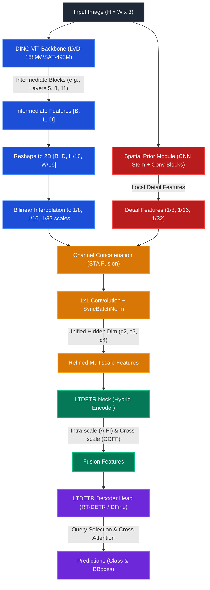

# Geospatial CV & YOLO Training Pipeline (`_trainer_lightly`)

This repository contains a locked, high-performance training, tuning, and evaluation suite for YOLO and RT-DETR model variants (using the Ultralytics and LightlyTrain backends), designed specifically for high-resolution aerial and satellite object detection.

---

## 🚀 Environment & Verification

We use [Pixi](https://pixi.sh/) for dependency and task management. To verify environment code style and static type safety, run:

```bash
# Formats code layout, runs Ruff checks/fixes, and Pyright static type checker
pixi run qa
```

### Available Tasks
* **Linting**: `pixi run lint` (ruff auto-fixes)
* **Formatting**: `pixi run format` (ruff code formatting)
* **Type Safety**: `pixi run check-types` (pyright static check)
* **GPU Diagnostic**: `pixi run check-gpu` (verifies PyTorch CUDA acceleration)
* **Suite Orchestration**:
  * Run Sweeps: `pixi run sweep`
  * Run Training: `pixi run train`
  * Run Baseline Benchmark: `pixi run train-baseline`
  * Run Evaluation: `pixi run eval`
  * Run FiftyOne Curation: `pixi run visualize`

---

## ⚙️ Central Configuration (Single Source of Truth)

All experiment parameters are defined in [config.py](file:///C:/Users/emilb/_trainer_lightly/config.py) under the `PipelineConfig` class. This includes paths, models to benchmark, seeds, W&B coordinates, and SAHI configurations.

---

## 🔍 Slicing Aided Hyper Inference (SAHI)

Detecting small objects in high-resolution aerial or satellite images is challenging because downsizing images for standard detectors degrades spatial details. SAHI solves this by splitting images into overlapping tiles, running detection on each tile, and merging overlaps.

### SAHI Configuration inside `PipelineConfig`
You can configure SAHI in [config.py](file:///C:/Users/emilb/_trainer_lightly/config.py):

* `sahi_enabled` (`bool`): Toggle SAHI sliced inference during evaluation (default: `False`).
* `sahi_slice_height` / `sahi_slice_width` (`int`): Dimension of each tile slice in pixels (default: `512`).
* `sahi_overlap_height_ratio` / `sahi_overlap_width_ratio` (`float`): Percentage of overlap between adjacent tiles (default: `0.2`).
* `sahi_perform_standard_pred` (`bool`): Perform standard full-resolution inference in parallel to capture larger objects (default: `True`).
* `sahi_postprocess_type` (`str`): Deduplication method: `"GREEDYNMM"` (default), `"NMM"`, or `"NMS"`.
* `sahi_postprocess_match_metric` (`str`): Metric for matching overlapping boxes: `"IOS"` (Intersection over Smaller, default) or `"IOU"`.
* `sahi_postprocess_match_threshold` (`float`): Score threshold for merging overlapping bounding boxes (default: `0.5`).
* `sahi_global_local_iou_threshold` (`float`): Suppresses tile predictions if they significantly overlap with global detections of the same class (default: `0.1`).

### Running Sahi on Evaluation

You can run SAHI during standalone evaluation on the test split by executing `run_evaluation.py` via Pixi or Python.

```bash
# Run SAHI evaluation using default config parameters
pixi run eval --sahi

# Explicitly disable SAHI inference (runs standard YOLO/RT-DETR validation)
pixi run eval --no-sahi

# Run SAHI evaluation with custom tile sizes and overlap ratios
pixi run eval --sahi --sahi-slice-height 640 --sahi-slice-width 640 --sahi-overlap 0.3
```

---

## 📊 Evaluation on Custom Datasets

By default, the evaluator loads the dataset specified in `PipelineConfig.dataset_path`. To run evaluation or SAHI on a different defined test dataset, supply its path via the `--dataset` CLI argument:

```bash
# Evaluate checkpoints on a separate out-of-distribution dataset YAML
pixi run eval --dataset C:\path\to\alternative_dataset.yaml

# Combine SAHI inference with custom dataset path evaluation
pixi run eval --sahi --dataset C:\path\to\alternative_dataset.yaml
```

This updates the dataset annotations structure dynamically, generates the split's COCO ground truth, executes inference (optionally with SAHI), and computes strict COCO metrics (`AP`, `AP50`, `AP75`, `AP_small`, `AP_medium`, `AP_large`) via `pycocotools`.

---

## 🧠 DINO to LTDETR Architecture Mapping

To use ViT-based foundation models (like DINOv2 and DINOv3) for real-time dense prediction tasks, we wrap them using a Spatial-Temporal-Attention (STA) fusion architecture. This maps the single-resolution block features of the transformer backbones to the multi-scale inputs expected by the LTDETR (RT-DETR/DFine) necks and heads.



### Architectural Pipeline Breakdown:

1. **DINO ViT Backbone Extraction**: 
   Vision Transformers (ViTs) output features at a single flat sequence dimension (typically $1/16$ resolution). LTDETR extracts intermediate features from three distinct depths of the backbone (e.g., layers 5, 8, and 11 for tiny models) to capture multi-level semantics.
   
2. **Spatial Prior Module (SPM)**: 
   To recover high-frequency spatial details lost during patchification, a lightweight CNN stem with MaxPool and Conv layers processes the original image. This creates multiscale detail features at $1/8$, $1/16$, and $1/32$ resolutions.

3. **STA / Detail Fusion**: 
   The ViT backbone features are reshaped to 2D and bilinearly interpolated to match the spatial prior's resolutions. The semantic and detail features are then concatenated along the channel dimension. A $1 \times 1$ convolution projects the fused tensors back to a unified hidden dimension ($D_{hidden}$), producing $c2$, $c3$, and $c4$ features.

4. **LTDETR Neck (Hybrid Encoder)**: 
   The multi-scale outputs are fed into the Hybrid Encoder. It uses intra-scale self-attention (AIFI) on the lowest resolution ($c4$) to capture global relationships, and cross-scale feature fusion (CCFF) to propagate representations across resolutions.

5. **LTDETR Decoder Head**: 
   The refined features from the neck are passed to the Transformer Decoder. By default, the custom DINOv3 models in this repository use the **RT-DETRv2** decoder head (`RTDETRTransformerv2`), but they can be configured to use the **D-FINE** decoder head (`DFINETransformer`).

### ⚙️ Decoder Head Options (RT-DETRv2 vs. D-FINE)

Under the `lightly-train` LTDETR framework, you can select which decoder head to attach to your backbone using the `decoder_name` model argument (either `"rtdetrv2"` or `"dfine"`):

* **RT-DETRv2 Head (`decoder_name="rtdetrv2"`) [Project Default]**:
  * **Method**: Traditional continuous direct regression of bounding box coordinates $(x, y, w, h)$ using L1 and GIoU loss.
  * **Refinement**: Uses simple coordinate offset prediction layers attached sequentially to each decoder block.
  * **Best For**: General real-time object detection where standard DETR regression is sufficient.

* **D-FINE Head (`decoder_name="dfine"`)**:
  * **Method**: Fine-grained Distribution Refinement (FDR). Bounding box boundaries are treated as a discrete probability distribution over bins rather than direct continuous values.
  * **Refinement**: Refines the shapes and borders of the boxes by iteratively shifting the peak coordinates of the distribution.
  * **Best For**: High-resolution geospatial, satellite, or aerial detection where high localization precision is critical (improves strict metrics like AP75 and AP_small).


